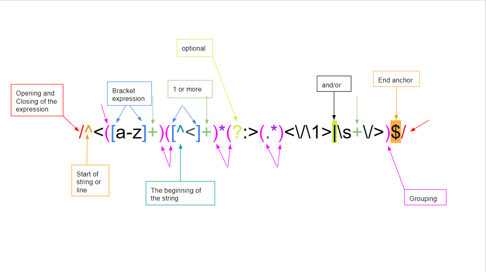

# animated-waddle

We were tasked to learn about regex and their componets. As well as their functions and how they can be useful in our day to day work.

## Summary

Regular expressions (regex) is very helpful when trying to find a specific variable within a code with thousands of text lines.
The format of regex are not subjected to a single language, which means that regardless of if you are on Javascript or
Mysql, the format of the regex is the same for both. Below is a website that is very useful for regex

Regexr Website: https://regexr.com

## Table of Contents

- [Anchors](#anchors)
- [Quantifiers](#quantifiers)
- [Grouping Constructs](#grouping-constructs)
- [Bracket Expressions](#bracket-expressions)
- [Character Classes](#character-classes)
- [The OR Operator](#the-or-operator)
- [Flags](#flags)
- [Character Escapes](#character-escapes)

## Regex Components

Regex is universally useable with most languages with very little trouble. Regex is a regual expression and it allows us to search
for key topics within code. The main components of regex are (as follows):
 - Anchors
 - Character classes
 - Quantifiers
 - Alteration

 Continue reading to learn more about the various components and how they can be useful to you in your career.

### Anchors

Anchors are extremly helpful when coding has multiple lines that you do or don't wish to go through.
The caret(^) is an anchor for the beginning of text and the dollar sign ($) is the ending anchor. Using both
helps you to define line(s) that you wish to search.

### Quantifiers

Quantifiers specify the amount of instances of a character, group, or character class that must be satifies for a match to be found. There
are four types of quantifiers that can be extremely useful.

- Greedy Quantifier
- Lazy Quantifier
- Possessive Quantifier
- Fixed Quantifier

### Grouping Constructs

Grouping constructs delineate the subexpressions of a regular expression and capture rhe substrings of an input string.
Bascially that means that anyting within parentheses ( ) will we treated as their own element. Think about it like in math how you
group numbers together, the same can be said for regex as well. 

### Bracket Expressions

Brackets is similar to grouping except the one major difference is that brackets are used to define a range,
whether number or letters, while parenthese can group multiple components together. For example,

/d[a-r]? is saying that you only want to match any decimal and that having a letter between a-r is optional.

/d([a-r]{2,4}?) means that you want a decimal with words that are two to four letters long, but that part is optional. 

### Character Classes

There are 6 character classes and they are as follows:

- \w : [A-Za-z0-9_] which means to match any character that is a letter or number regardless to capitiliztion and underscores. 
- \W : [^A-Za-z0-9_] is the opposite of \w meaning that you  DO NOT want to match any character that is a letter or number regardless to capitiliztion and underscores.
- \d : [0-9] matches any character that is a digit.
- \D : [^0-9] matches any character that is NOT a digit.
- \s : [\t\r\n\f] matches any character that is "whitespace" (ie. spaces, tabs, newlines, etc.).
- \S : [^\t\r\n\f] matches any character that is NOT "whitespace".

### The OR Operator

The OR operator is represented with | and it works exactly how you think it should. It means that var 1 and/or var 2 will both be matched.

### Flags

Flags are at the end or regex outside the slashes. There are multiple such as global, case-senstive, multi-line. These allow you to search for sepcific items.
For example, in case-senstive, E is not the same as e. Global allows you to search the entire file and multi-line means that instead of reading a chunk of code
as one single item, it will go through each line of the code and search for what you want/need.

### Character Escapes

Character Escapes allows you to look for certian characters without interferring with the program itself.
For example, a period . by itself is a function of the regex so in order to be able to search for all periods you would need to put \.

\ is the character escapes which basically nullifies the specali charaters into regular searchable characters.

## Author

I am a fullstack code developer. I got a BS in Civil Engineering and is elegiable for certification for completing the fullstack course.
I enjoy styling more than coding, but I am fine with either. I am hoping that coding will be my career for years to come.

https://github.com/C-Bolick

